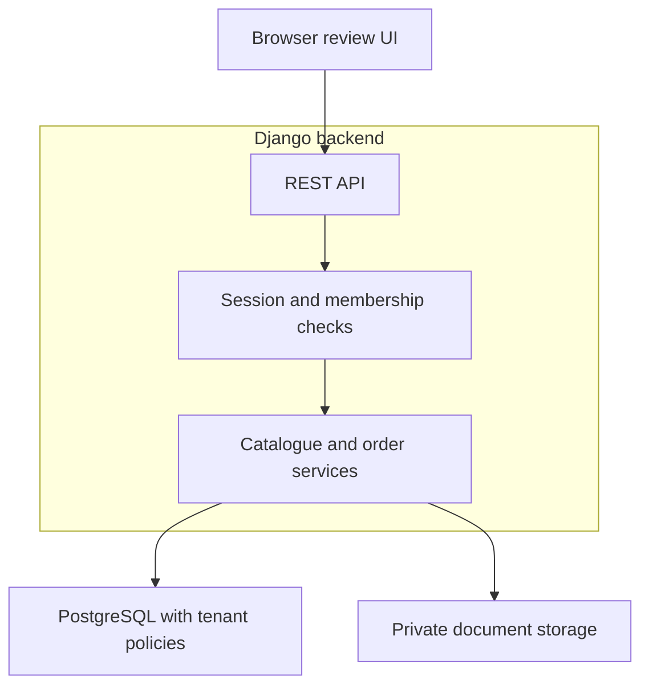
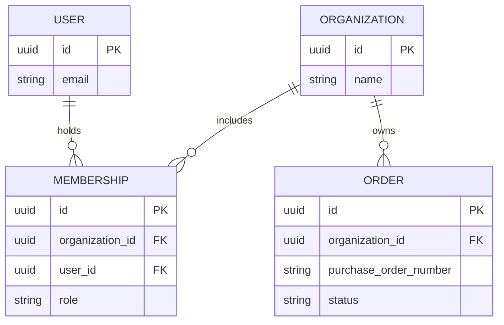

# Step 2 — Backend stack and tenancy

Date: 2026-10-04
Status: Accepted by the founder for Step 3 on 2026-10-04. Tenant roles and
customer-specific compliance/deployment requirements still need confirmation.

## Goal and confirmed constraints

Choose the backend and customer workspace design before creating Django
migrations. Build collaboratively in small steps, with secure defaults and
clear file locations.

- Solo developer with six years of software development experience.
- Zero spending on software subscriptions, hosting, or AI APIs.
- Windows 11 Pro, 64-bit, with 15.7 GB RAM.
- Docker Compose 5.1.3 and host Python 3.13.12.
- PostgreSQL 18.6 is running locally; SQL access and persistence after container
  recreation were verified by the founder.
- Product: uploaded purchase orders, catalogue matching, discrepancy review,
  mandatory staff approval initially, and an ERP import file.

This proposal does not establish a deployment region, compliance certification,
first ERP, or customer approval-role policy. Confirm those requirements before
using customer documents or launching a live pilot.

## ADR-001 — Django modular monolith with Django REST Framework

### Context

This product needs durable orders, catalogue data, users, approvals, audit
records, and integrations. One developer must maintain both the product and
its operations. Framework selection should reduce the amount of common SaaS
infrastructure that has to be assembled and maintained.

### Options

| Option | Strength | Trade-off for this product |
| --- | --- | --- |
| Django with Django REST Framework | Integrated ORM, migrations, sessions, password handling, administration, and a mature API ecosystem | More conventions; typed services and clear validation boundaries need deliberate design |
| FastAPI with SQLAlchemy and Alembic | API-first design, type-driven validation, OpenAPI generation, and async support | Authentication lifecycle, administration, organization permissions, and several other components need separate integration |

Both options are viable. The recommendation is based on this product's workflow
and the solo-maintainer constraint, rather than an assertion that one framework
is universally superior.

### Accepted decision

Use Django 5.2 LTS, Django REST Framework, Django ORM and migrations, Psycopg 3,
and PostgreSQL. Structure one backend codebase into feature-oriented Django
apps. Use REST/JSON under `/api/v1/`.

Verified version baseline:

| Component | Baseline | Reason |
| --- | --- | --- |
| Backend Python | CPython 3.14.8, isolated from the host installation | Current bugfix release listed by Python.org; supported by Django 5.2 and DRF |
| Django | 5.2.17 LTS | Latest listed patch in the 5.2 LTS series; extended support through April 2028 |
| Django REST Framework | 3.18.1 | Latest release in the retrieved official release notes; supports Django 5.2 |
| PostgreSQL | Existing 18.6 service | Verified working locally; relational and transactional storage |
| Psycopg, uv, Ruff | Stable versions to resolve and lock in Step 3 | Check Python compatibility and package metadata together before installation |

The host's Python 3.13.12 can run the existing setup helper. Python.org currently
lists 3.13.16 as a newer security release in that series. For the backend, use
the isolated 3.14.8 environment so the new project starts with a current runtime.
Step 3 will decide the exact container/venv commands, resolve dependencies, and
produce the lockfile. Do not install development releases based on a project's
development documentation version number.

For browser authentication, use Django sessions in HttpOnly cookies, a same-origin
API arrangement, HTTPS and Secure cookies in deployment, and CSRF protection.
Login endpoints must have CSRF protection even before a session is authenticated.
Organization authorization is application logic, separate from Django login.
Machine-to-machine ERP authentication can be designed when an actual integration
requires it.

Use uv for project environments and dependency locking; Ruff for linting and
formatting; Django's test runner and DRF test utilities for the initial backend
tests. Introduce type checking with Django-aware configuration during developer
tooling setup. The framework admin is an operator tool; staff order review gets
its own product UI when frontend work starts.

### Boundaries and growth

Keep views concerned with HTTP, serializers with request/response validation,
models with persisted data and constraints, and service functions with domain
actions and transaction boundaries. Add query helpers when a query needs reuse
or significant logic. Use Django ORM directly instead of wrapping every model
in generic repository classes.

Long-running extraction will run in a background worker using the same codebase
when that feature is introduced. Choose and validate a durable job mechanism at
that step. Separate processes for web requests and extraction do not require
separate services or repositories.

Split a module into a separately owned service only after measured resource
contention, different reliability requirements, or a team boundary justifies it.

The UI and document-processing modules are planned components. This diagram
describes the intended boundaries, not services already running on the laptop.

### Consequences and review triggers

Common backend capabilities come from established framework components.
Tenant authorization, order validation, review behavior, and ERP mapping remain
our responsibility. Django support dates and all dependency pins must be checked
again when implementing or upgrading. A release is production-ready only after
its functional, security, isolation, deployment, and recovery checks pass.

## ADR-002 — Organization workspaces in a shared database and schema

### Context

Each distributor needs a private workspace for its catalogue, customer pricing,
purchase orders, documents, rules, and staff. A consultant or staff member may
eventually belong to several organizations with different permissions. An
initial single-distributor pilot should use the same ownership model as the
eventual SaaS product.

### Options

| Model | Strength | Operational trade-off |
| --- | --- | --- |
| Separate database per organization | Easier independent database backup and customer-specific hosting | Repeated migration, routing, connection, and recovery operations |
| Separate schema per organization | Table namespaces separated within one database | Schema routing, search-path management, and repeated schema migrations |
| Shared database and schema with organization IDs | One schema and migration stream, suitable for a solo-operated SaaS | Isolation depends on explicit application authorization and correctly enforced database policies |

### Accepted decision

Use one organization workspace per distributor, one shared PostgreSQL database,
and one shared schema. Every tenant-owned business row has a required
`organization_id`. Users are global identities; membership relates each user
to an organization and its role. Membership is unique per organization/user pair.

Logical core, not a completed database migration:

The full order model, including customer, revisions, pricing provenance, and
approval evidence, will be designed with that feature. Purchase-order numbers
are not assumed globally unique.

Proposed initial roles, subject to confirming the customer's workflow:

| Role | Permissions |
| --- | --- |
| Admin | Manage workspace users and configuration; review, approve, and export orders |
| Reviewer | Upload, correct, review, approve, and export orders |
| Viewer | Read permitted workspace information |

Roles live on Membership, not on User. A reviewer in organization A might be a
viewer in organization B. Django `is_staff` and `is_superuser` are operator
privileges and must not become customer workspace roles.

### Required isolation controls

1. Resolve a requested organization only after authenticating the user and
   verifying an active membership. Workspace discovery returns that user's
   memberships, not the global organization directory.
2. Scope business queries, creation, updates, approvals, and exports to the
   authorized organization. The server assigns ownership; client input cannot
   choose a different organization on a new row.
3. Enforce PostgreSQL row-level security on tenant business tables before
   exposing their APIs. Missing tenant context denies access. Set context
   transaction-locally so pooled connections do not retain a previous tenant.
4. Use a non-owner runtime database role with no superuser or BYPASSRLS
   privileges. Schema migrations use a separate owner/migration role.
5. Include organization ownership in appropriate uniqueness rules and enforce
   tenant-consistent relationships. RLS alone does not make a reference to
   another organization's row safe.
6. Check authorization on document downloads and exports. Store files privately;
   a directory prefix or unpredictable UUID alone is not authorization.
7. Carry organization identity into jobs, rules, usage records, audit logs, and
   future cache keys. Re-check permissions on sensitive actions where relevant.
8. Keep global support access exceptional and audited. Tenant administrators
   cannot elevate themselves to Django operators or bypass database policies.

The current `orderdesk_dev_admin` account is a database superuser used to
bootstrap the local service. It must not become the web application's runtime
account. PostgreSQL superusers and BYPASSRLS roles always bypass row policies;
table owners normally bypass them too. FORCE ROW LEVEL SECURITY can apply to
owners, but does not restrict superusers or BYPASSRLS roles.

RLS reduces the impact of missing query filters. It does not replace membership
checks, input validation, or SQL-injection protection, and must be tested using
the real restricted runtime role.

### Acceptance tests for the tenancy implementation

Before adding live customer data, verify with two seeded organizations:

- Organization A cannot list, retrieve, modify, approve, export, or download B's
  data, including by substituting IDs in requests.
- A creation request cannot assign ownership to a different organization.
- A deliberately unfiltered business query is blocked or scoped by RLS when
  executed as the runtime role.
- Missing context denies access, and alternating organizations on a reused
  connection does not leak the previous context.
- A relationship cannot join tenant-owned rows from different organizations.
- Background jobs preserve and validate organization ownership.
- Tenant administrators cannot gain operator privileges.

These tests are requirements for later implementation, not checks already
performed in Step 2. DRF object permissions do not automatically filter list
responses or enforce ownership on creation; those paths need explicit controls.

### Consequences and review triggers

A single-distributor customer-hosted pilot can run this code with one populated
organization. A separate deployment can provide physical hosting isolation when
a customer requires it. Moving customers between deployments still requires a
planned data, document, account, and audit-history migration; it is not a free
automatic switch.

Confirm customer requirements for data residency, shared infrastructure, access
control, and retention before choosing production hosting. Shared-database
operations also require tenant-aware backup/export/deletion procedures and
restore drills, which will be designed before a live pilot.

## Recommended tools and alternatives

All recommended components run locally or on customer-provided infrastructure.
Managed hosting is optional in the future and has a separate cost decision.

| Tool | Purpose and fit | License | Maturity/community | Alternative |
| --- | --- | --- | --- | --- |
| Django | ORM, migrations, authentication, sessions, and operator admin | BSD-3-Clause | Long-established; formal security and LTS support | FastAPI with separately integrated components |
| Django REST Framework | REST APIs, serialization, permission hooks, and API tests | BSD-3-Clause | Long-established; active releases and broad Django ecosystem | Django Ninja |
| PostgreSQL | Transactional catalogue/order storage and RLS | PostgreSQL License, permissive | Long-established; maintained server and tooling ecosystem | MariaDB, requiring a different isolation design |
| Psycopg 3 | PostgreSQL driver used by Django | LGPL-3.0 | Maintained successor to the long-established Psycopg adapter | Psycopg 2, with separate compatibility review |
| uv | Isolated environments, runtime management, and lockfiles | MIT OR Apache-2.0 | Newer than Django; actively developed by Astral | pip plus pip-tools |
| Ruff | Linting and formatting with one tool | MIT | Actively developed by Astral with a substantial contributor ecosystem | Black plus Flake8 and isort |
| Django/DRF test utilities | Unit, database, and API verification | Framework BSD licenses | Maintained alongside the frameworks | pytest with pytest-django |

Psycopg is a weak-copyleft dependency. Review LGPL and bundled-library
redistribution requirements before delivering customer-hosted packages, retain
applicable notices, and document the selected distributions. SaaS operation and
redistributing binaries are different licensing situations.

## Files and next implementation step

Save this decision record at:

`C:\Users\HomePC\Desktop\billion1\order-desk\docs\AI_Order_Desk_Step_02_Backend_and_Tenancy.md`

Only this documentation file is introduced in Step 2. Planned Step 3 locations:

| Location relative to order-desk | Purpose |
| --- | --- |
| backend/pyproject.toml | Backend dependencies and tool settings |
| backend/uv.lock | Resolved dependency versions, committed to Git |
| backend/manage.py | Django management commands |
| backend/config/ | Settings, URL routing, and server entry points |
| backend/apps/accounts/ | Custom user model, established before the first migration |
| backend/apps/health/ | Minimal health endpoints and their tests |
| backend/Dockerfile | Reproducible Linux backend environment |
| compose.yaml | Add backend service alongside the verified database |

Tenancy models, policies, and role enforcement will follow in their own focused
step before business APIs. Feature apps for catalogues, orders, extraction, and
ERP imports are added when each feature is built, with typed service boundaries,
schema constraints, migrations, API contracts, and meaningful tests.

## Common pitfalls

- Treating authentication as sufficient organization authorization.
- Trusting organization IDs from request payloads without membership checks.
- Testing RLS with the existing superuser and misinterpreting the results.
- Assuming DRF object permission checks protect lists and create operations.
- Running the first migrations before declaring a custom user model.
- Running long extraction work inside a web request or holding a database
  transaction open while waiting for a model.
- Treating laptop demonstrations as a verified production deployment.

## Definition of Done and next prompt

- [ ] Backend option and LTS trade-off are understood.
- [ ] Organization workspaces and membership-scoped roles are understood.
- [ ] Application authorization, database isolation, and document permissions
  are recognized as separate required controls.
- [ ] Dedicated hosting/residency needs remain a customer requirement to confirm.
- [x] The backend stack and tenancy model are accepted before implementation.

Next prompt:

> Use Django, Django REST Framework, and the shared-database organization model.
> Start Step 3: initialize the backend, locked dependencies, settings, custom
> user model, and health endpoint. Explain each file and command, and stop after
> verification.

## Official sources checked on 2026-10-04

- [Python release versions and support status](https://www.python.org/downloads/)
- [Django versions and support dates](https://www.djangoproject.com/download/)
- [Django 5.2 Python compatibility](https://docs.djangoproject.com/en/5.2/faq/install/)
- [Django license](https://github.com/django/django/blob/main/LICENSE)
- [Django custom user model timing](https://docs.djangoproject.com/en/5.2/topics/auth/customizing/)
- [DRF release notes](https://www.django-rest-framework.org/community/release-notes/)
- [DRF compatibility requirements](https://www.django-rest-framework.org/)
- [DRF permission limitations](https://www.django-rest-framework.org/api-guide/permissions/)
- [DRF session authentication and CSRF](https://www.django-rest-framework.org/api-guide/authentication/)
- [DRF license](https://github.com/encode/django-rest-framework/blob/main/LICENSE.md)
- [PostgreSQL row security](https://www.postgresql.org/docs/18/ddl-rowsecurity.html)
- [Psycopg installation](https://www.psycopg.org/psycopg3/docs/basic/install.html)
- [Psycopg license](https://github.com/psycopg/psycopg/blob/master/LICENSE.txt)
- [uv documentation](https://docs.astral.sh/uv/)
- [uv licensing](https://docs.astral.sh/uv/policies/license/)
- [Ruff documentation](https://docs.astral.sh/ruff/)
- [Ruff license](https://github.com/astral-sh/ruff/blob/main/LICENSE)
- [Django testing](https://docs.djangoproject.com/en/5.2/topics/testing/overview/)

Recheck support dates, package compatibility, and stable versions against these
official sources when implementing Step 3. These architecture decisions are
accepted; Step 3 adds the backend foundation. RLS enforcement follows in a
separate implementation step.
