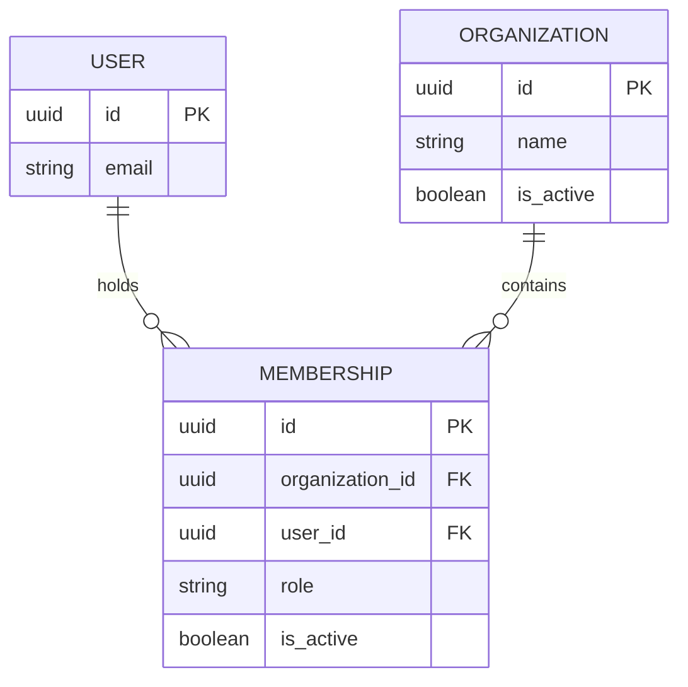

# Step 4A — organizations, memberships, and application access

## Goal

Add one distributor workspace model, one membership model, and a small set of
authorized reads/writes. Keep the accepted stack and dependency lock. This
increment requires no paid service, dependency installation, or frontend work.
Allow roughly 30–45 minutes to inspect, apply, and verify it.

Step 4 is deliberately split into reviewable increments:

| Increment | Result |
| --- | --- |
| **4A — this patch** | Organizations, memberships, constraints, scoped reads, and transactional creation/add-member services. |
| 4B — after verification | Authenticated workspace discovery/selection and request-level tenant context. |
| 4C — subsequent verification | Transaction-local database context and PostgreSQL row policies for tenant business data, tested with the restricted runtime role. |

**The database row policies are not installed by 4A.** Application helpers
enforce their access rules, but a raw, unfiltered ORM query can still read the
workspace tables. This is an internal foundation with no new HTTP endpoint or
customer admin UI. Complete request authorization and database-policy checks
before exposing tenant business APIs or using live customer documents.

## 1. Understand the data

- A **User** is one global login identity, already implemented in Step 3.
- An **Organization** is one distributor workspace. Its UUID identifies it;
  its display name is not unique and is not an authorization mechanism.
- A **Membership** connects a user to an organization and stores that user's
  role there. Each user/organization pair is unique, including inactive records.



For example, the same person can be an administrator in Distributor A and a
viewer in Distributor B. Being an administrator in A does not grant permission
to add staff in B. Django's `is_staff`/`is_superuser` flags do not supply a
workspace membership or bypass these application access checks.

| Membership role | Behavior implemented in this increment |
| --- | --- |
| `admin` | Access the workspace, inspect its memberships, and add an existing active account with a validated workspace role. |
| `reviewer` | Resolve its own active workspace membership. Order-review permissions will be implemented with orders. |
| `viewer` | Resolve its own active workspace membership; default for a newly added member. Order-read permissions will be implemented with orders. |

These are the initial role names from our tenancy decision. Order approval,
exports, billing administration, invitations, membership edits/removal, and
last-administrator protection belong to their respective future features.
There is no role-edit or deletion API in this increment.

## 2. Apply the additive patch

Download `AI_Order_Desk_Step_04A_Workspaces.zip`. Its paths start at the existing
project root. It adds only the organizations module and this walkthrough; it
does not replace your settings, user model, Compose file, lock, secrets, or data.

In PowerShell:

```powershell
Set-Location -LiteralPath "C:\Users\HomePC\Desktop\billion1\order-desk" -ErrorAction Stop
docker compose stop api
if ($LASTEXITCODE -ne 0) { throw "Could not stop the local API." }
Expand-Archive -LiteralPath "$env:USERPROFILE\Downloads\AI_Order_Desk_Step_04A_Workspaces.zip" -DestinationPath . -Force -ErrorAction Stop
```

`Set-Location` selects the existing project. `stop api` stops the local server
while its new app is registered and migrated; PostgreSQL stays running.
`Expand-Archive` places the new source files at their final paths. Adjust only
the ZIP download location if necessary. Do not create another nested
`order-desk` folder.

### One manual settings edit

Open `backend/config/settings/base.py`. Inside `INSTALLED_APPS`, add exactly
this entry once:

```python
    "apps.organizations.apps.OrganizationsConfig",
```

The relevant end of the list should now look like:

```python
    "rest_framework",
    "apps.accounts.apps.AccountsConfig",
    "apps.health.apps.HealthConfig",
    "apps.organizations.apps.OrganizationsConfig",
]
```

This registers models, migrations, and tests with Django. Preserve your other
settings. Existing local/test/production settings inherit this shared app list.

## 3. What each file does

All module paths below begin with `backend/apps/organizations/`.

| File | Responsibility |
| --- | --- |
| `apps.py` | Defines `OrganizationsConfig`; Django app label is `organizations`. |
| `models.py` | Defines organization/membership records, UUIDs, activity flags, timestamps, role choices, protected relationships, and database constraints. |
| `access.py` | Requires an authenticated, persisted, currently active user and an active membership in an active workspace. Requires a workspace admin where needed. Returns the same error for unknown and unauthorized workspace IDs. |
| `selectors.py` | Reusable permission-scoped reads: workspace discovery for a user and membership listing for a workspace administrator. Keeps access predicates in the lazy queries so subsequent revocation cannot preserve the old result set. |
| `services.py` | Two authorized write actions. Workspace creation and its first admin membership commit together. Adding an existing member requires a current admin membership and locks that organization's row. |
| `migrations/0001_initial.py` | Generated, committed migration. Depends on the configured custom user and creates the two tables and constraints. Do not edit an applied migration. |
| `tests/test_models.py` | Checks DB constraints, distinct workspace identities, default roles, multiple memberships, and protected deletion. |
| `tests/test_access.py` | Checks tenant-scoped reads, guessed IDs, cross-workspace role differences, inactivity, stale user objects, lazy-query revocation, and operator flags. |
| `tests/test_services.py` | Checks creation rollback, validation, admin authorization, cross-workspace denial, and duplicate membership handling. |
| `tests/test_concurrency.py` | Uses independent connections to submit simultaneous adds of the same member. Requires PostgreSQL row-lock support; one add must succeed and one must reject the duplicate. |
| `__init__.py`, `migrations/__init__.py`, `tests/__init__.py` | Empty Python package markers for module, migration, and test discovery. |

The remaining file, `docs/AI_Order_Desk_Step_04A_Workspaces.md`, is this guide.
There is no organization admin registration or new URL configuration yet.

### Database invariants

The tables are `organizations_organization` and `organizations_membership`.

| Constraint | Why it is enforced in the database |
| --- | --- |
| UUID primary keys | Stable identities survive name changes. |
| Required organization/user foreign keys | A membership cannot exist without its workspace and account. |
| Unique `(organization_id, user_id)` | Direct writes cannot create duplicate memberships. Deactivation does not permit a second parallel record. |
| Allowed role values | Django `choices` validates application input; the CHECK constraint also rejects invalid roles in direct database writes. |
| Nonblank organization name | Blank/whitespace names are rejected even when model validation is bypassed. |

Foreign keys and the composite unique constraint supply the initial indexes.
No extra activity-flag indexes are needed for this small membership workload.
Names are display values, so two distributors with the same name remain separate
workspaces. `PROTECT` stops accidental deletion through Django; an explicit
retention/deletion workflow will follow. Deactivation alone is not data erasure.

### Internal contracts

These are Python service/query contracts, not HTTP endpoints:

| Function | Contract |
| --- | --- |
| `create_organization(actor=..., name=...)` | Active persisted actor plus validated name; returns the organization with an admin membership for its creator. Never sets operator flags. |
| `add_member(actor=..., organization_id=..., user_id=..., role=...)` | Requires admin membership in that organization. Target is an existing active user. Default role is viewer. Validates and returns one membership. |
| `organizations_for_user(user=...)` | Returns only workspaces in which that active user has an active membership. |
| `memberships_for_organization(user=..., organization_id=...)` | Returns that workspace's membership records, including inactive records for later administration, only to its admin. |
| `require_membership(user=..., organization_id=...)` | Returns the authorized active membership; otherwise raises `PermissionDenied`. |
| `require_workspace_admin(user=..., organization_id=...)` | Also requires that membership's role to be admin. |

Use the authenticated server-side user as the actor. A future API must validate
UUIDs and input types before calling these functions and choose server-side
roles for each action. Do not turn a client-supplied user ID into an actor.
The service signatures intentionally do not accept arbitrary user/model fields.

`ValidationError` represents invalid input or duplicate membership.
`PermissionDenied` represents missing access. Future HTTP views will translate
these into their documented API responses.

### Why transactions and a row lock

`transaction.atomic` rolls back the new organization if its initial membership
fails. Explicit services make that boundary visible; hidden model signals are
unnecessary here.

`add_member` locks its organization row with `select_for_update`, then checks
the actor's admin membership. Concurrent service calls for that workspace are
serialized. A second identical add sees the first committed membership and
fails validation. The unique constraint remains the final guard against direct
or future writes. Future membership mutations must use the same lock order.

Transactions are short and contain only database work. Email invitations and
document extraction must not happen while holding the lock. SQLite does not
provide this PostgreSQL locking behavior, which is why the concurrency test is
explicitly database-specific.

## 4. Migrate and verify on PostgreSQL

Run the following from the existing project root:

```powershell
docker compose run --rm manage python manage.py check
if ($LASTEXITCODE -ne 0) { throw "Django app registration checks failed." }
docker compose run --rm manage python manage.py migrate --noinput
if ($LASTEXITCODE -ne 0) { throw "Workspace migrations failed." }
docker compose run --rm manage python manage.py makemigrations --check --dry-run
if ($LASTEXITCODE -ne 0) { throw "Committed migrations do not match the models." }
docker compose run --rm manage python manage.py test --settings=config.settings.test --keepdb --noinput -v 2
if ($LASTEXITCODE -ne 0) { throw "Backend tests failed." }
docker compose run --rm manage ruff check .
if ($LASTEXITCODE -ne 0) { throw "Lint checks failed." }
docker compose run --rm manage ruff format --check .
if ($LASTEXITCODE -ne 0) { throw "Formatting checks failed." }
docker compose up -d --wait --wait-timeout 120 api
if ($LASTEXITCODE -ne 0) { throw "API startup or readiness failed." }
docker compose exec api python manage.py check_runtime_role
if ($LASTEXITCODE -ne 0) { throw "Runtime database privileges are unsafe." }
```

| Command | Purpose |
| --- | --- |
| `check` | Confirms Django sees the new app and its models. |
| `migrate --noinput` | Applies the committed schema as `orderdesk_migrator`. Expect `organizations.0001_initial... OK`. |
| `makemigrations --check --dry-run` | Checks for model/migration drift without writing files. Expect `No changes detected`. |
| `test ... --keepdb` | Runs the foundation and new workspace tests on the dedicated `test_orderdesk` database. |
| `ruff check .` / `ruff format --check .` | Checks lint and formatting with the existing pinned tool. |
| `up ... api` | Starts the regular API and waits for readiness. |
| `check_runtime_role` | Confirms the runtime remains a non-owner role without privileged capabilities after the new migration. |

The Step 3 starter plus this increment has **63 Django tests**, including
**38 new organization tests**. On PostgreSQL, all should pass. The test named
`test_simultaneous_duplicate_adds_create_one_membership` must report `ok`,
not skipped. If you have added your own tests, the total can be higher.

Source is already bind-mounted into the Step 3 image, so no rebuild is required
for this source-only increment. There are no dependency, password, or volume
changes. Existing default grants apply to tables created by the migration role;
do not rerun initialization or grant schema ownership to the API.

### Check ownership and runtime SELECT access

```powershell
docker compose exec db psql -U orderdesk_dev_admin -d orderdesk -v ON_ERROR_STOP=1 -c "SELECT tablename, tableowner FROM pg_tables WHERE schemaname = 'public' AND tablename IN ('organizations_organization', 'organizations_membership') ORDER BY tablename;"
if ($LASTEXITCODE -ne 0) { throw "Workspace ownership check failed." }
docker compose exec api python manage.py shell -c "from apps.organizations.models import Organization, Membership; print('Runtime SELECT access:', Organization.objects.count(), Membership.objects.count())"
if ($LASTEXITCODE -ne 0) { throw "Runtime access to the new tables failed." }
```

Both tables must be owned by `orderdesk_migrator`. The second command executes
real ORM queries as `orderdesk_app` and must succeed. On a fresh installation
the counts are `0 0`: test fixtures were created in the test database, not the
application database. Existing main-database workspace counts can be higher.
This is an infrastructure check; a global count is not a customer API contract.

Finally:

```powershell
docker compose ps
Invoke-RestMethod -Uri "http://127.0.0.1:8000/api/v1/health/live/"
Invoke-RestMethod -Uri "http://127.0.0.1:8000/api/v1/health/ready/"
```

Both containers should be healthy. Each response should contain `status: ok`.
Keep the original database volume; do not use `docker compose down -v`.

### Checks completed while preparing the patch

Python 3.14.8 was used with the existing locked dependencies. Django system
checks, migration consistency, Ruff lint/format checks, and lock consistency
pass. The application suite reports **62 passed and one skipped** in the
temporary SQLite harness outside this deliverable. The skipped check is the
PostgreSQL concurrency test. Container execution, PostgreSQL constraints,
runtime grants, and real row locking require the commands above on your
machine. No PostgreSQL result is inferred from the SQLite tests.

## 5. Review and commit

After all checks pass:

```powershell
git status --short
git add backend/apps/organizations backend/config/settings/base.py docs/AI_Order_Desk_Step_04A_Workspaces.md
git diff --cached --stat
git commit -m "feat: add organizations and membership access foundation"
if ($LASTEXITCODE -ne 0) { throw "Commit failed." }
```

`status` shows the files you changed. `add` stages the new module, one settings
entry, and this guide. `diff --cached --stat` lets you review the staged paths.
`commit` records this verified increment locally. Do not stage `.env`, caches,
or virtual environments.

## Tools and trade-offs

No new packages or managed services are introduced.

| Tool | Fit / maturity | License | Local / managed | Alternative |
| --- | --- | --- | --- | --- |
| Django ORM and migrations | Mature, actively maintained; models, constraints, and short transactions fit this shared relational design. | BSD-3-Clause | Runs in the existing self-hosted app; optional managed host later. | SQLAlchemy with Alembic, requiring a different backend integration. |
| PostgreSQL | Mature transactional database with row locks, constraints, and later RLS. | PostgreSQL License, permissive | Existing local container; managed database optional later. | MariaDB, with a different isolation implementation. |
| Django TestCase / TransactionTestCase | Mature framework tools; fast behavior tests plus genuine independent-connection concurrency checks. | BSD-3-Clause | Existing local test database; CI later. | pytest with pytest-django. |
| Ruff | Actively maintained; existing lint/format rules apply to the new module. | MIT | Existing local CLI; no account needed. | Black plus Flake8/isort. |

## Common pitfalls

- **Moving a workspace role onto User:** the same person may have different
  roles in different distributors. Role belongs on Membership.
- **Assuming a UUID supplies permission:** every workspace lookup needs the
  active-user/membership check.
- **Using Django operator flags for tenant authorization:** an operator without
  a membership is denied by these helpers.
- **Treating `choices` as a database constraint:** both input validation and the
  DB CHECK are needed to reject invalid roles from direct writes.
- **Creating workspaces and initial memberships separately:** partial failures
  would leave ownerless workspaces. Use the transactional service.
- **Keeping a lazy query after revocation:** query predicates must continue to
  restrict data when the query is evaluated.
- **Calling raw ORM from future HTTP views:** use the scoped access/selector
  boundary. RLS will add database enforcement for business rows in 4C.
- **Testing PostgreSQL concurrency with SQLite:** SQLite skips the row-lock test;
  PostgreSQL must run it successfully before this increment is accepted.
- **Recreating inactive memberships:** the pair stays unique; reactivation will
  be an explicit authorized action with audit behavior, not a second row.
- **Granting CREATEDB/superuser to fix test errors:** retain `--keepdb` and the
  dedicated provisioned test database.

## Definition of Done — stop after 4A

- [ ] The organizations app is registered once in shared settings.
- [ ] The committed migration applies and both tables belong to the migration role.
- [ ] All 38 organization tests pass on PostgreSQL, including the concurrency test.
- [ ] The full backend suite passes and migration/lint/format checks succeed.
- [ ] Runtime SELECT access and the existing role guard succeed.
- [ ] Both services remain healthy and both health responses contain `ok`.
- [ ] This increment is committed locally.
- [ ] The boundary is clear: HTTP tenant selection and database row policies follow.

Send this exact next prompt after verification:

> Step 4A verified. Here are my migration output, test summary including the
> concurrency test, table ownership output, and health responses: __.
> Start Step 4B: authenticated workspace discovery and selection, one small
> step at a time.

If a check fails, share that command and its redacted error instead. Do not send
`.env` or database passwords. We will resolve the failure before adding APIs.

## Official references checked for this increment

- Django constraints: https://docs.djangoproject.com/en/5.2/ref/models/constraints/
- Django transactions: https://docs.djangoproject.com/en/5.2/topics/db/transactions/
- Django row locks / SQLite limitation: https://docs.djangoproject.com/en/5.2/ref/models/querysets/#select-for-update
- Django test database features: https://docs.djangoproject.com/en/5.2/topics/testing/tools/#skipunlessdbfeature
- PostgreSQL row policies: https://www.postgresql.org/docs/18/ddl-rowsecurity.html

Keep the accepted dependency pins for this increment. Verify official support
and compatibility documentation when deliberately upgrading them; installing a
new version is not required to add these models.
