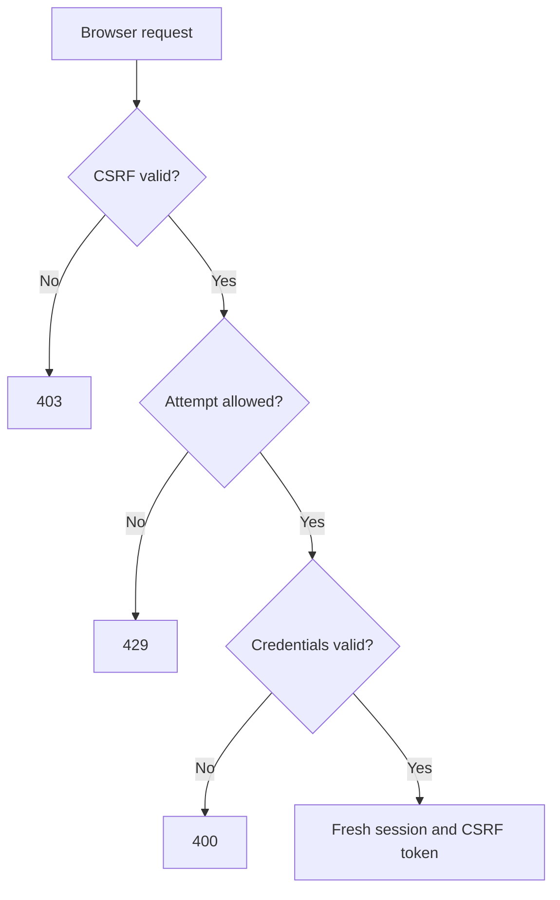

# Step 4B.2 — CSRF-protected session login and logout

## Goal

Add customer email/password sign-in and sign-out using the existing Django
database sessions. Protect anonymous login as well as logout with Django's
CSRF checks. Add shared login attempt budgets using the existing PostgreSQL
database. Allow about 30–45 minutes to review, apply, and verify this increment.

Your Step 4B.1 log confirms all 81 tests passed on PostgreSQL, both health
responses returned `ok`, the runtime role stayed restricted, and the discovery
change was committed with a clean working tree.

| Increment | Result |
| --- | --- |
| 4B.1 — verified | Read-only discovery of the signed-in user's active workspaces. |
| **4B.2 — this patch** | CSRF bootstrap, credential login, logout, shared attempt budgets, and a local HTTP verifier. |
| 4B.3 — after verification | Workspace selection and request context with membership revalidation. |
| 4C — after Step 4B | PostgreSQL transaction context and row policies for tenant business data. |

The patch costs $0 and changes no dependency versions. It adds one table and
uses Django's password verification, session storage, session invalidation,
and CSRF implementation. Registration, invitations, password reset, MFA, and
the frontend belong to later increments. Row policies still belong to 4C.

## 1. Apply the additive patch

Download `AI_Order_Desk_Step_04B2_Session_Auth.zip`. It adds the authentication
module files within the existing accounts app, a committed migration, tests,
two management commands, the standard-library verifier, and this guide.
Existing models/settings/routes are edited manually below.

Run in PowerShell:

```powershell
Set-Location -LiteralPath "C:\Users\HomePC\Desktop\billion1\order-desk" -ErrorAction Stop
docker compose stop api
if ($LASTEXITCODE -ne 0) { throw "Could not stop the local API." }
Expand-Archive -LiteralPath "$env:USERPROFILE\Downloads\AI_Order_Desk_Step_04B2_Session_Auth.zip" -DestinationPath . -Force -ErrorAction Stop
```

`Set-Location` selects the existing project. `stop api` keeps the local API
stopped while its model/settings and migration change together; PostgreSQL
continues running. `Expand-Archive` adds files under the existing root.
Adjust only the ZIP download location if necessary.

### Edit 1: append the counter model

Open `backend/apps/accounts/models.py`. Keep the existing `User` class. Add
the following separate class at the end of the file, after two blank lines:

```python
class LoginAttemptBucket(models.Model):
    """Shared login budgets; keys are HMAC digests, never raw emails or IPs."""

    key = models.CharField(max_length=64, primary_key=True)
    window_started_at = models.DateTimeField(db_index=True)
    attempts = models.PositiveIntegerField(default=0)

    def __str__(self) -> str:
        return f"Login attempt counter {self.key[:12]}"
```

The file already imports `models`; no extra import is necessary. This is a
global authentication record, so it has no organization foreign key. A user
signs in before choosing a distributor workspace.

| Field | Purpose |
| --- | --- |
| `key` | Unique HMAC-SHA256 digest of a normalized email or network peer, with separate namespaces. Keeps raw email/IP values out of this table. |
| `window_started_at` | Start of the current fixed window; indexed for pruning old counters. |
| `attempts` | Number of reserved credential checks in that window. Positive integer field supplies the database's nonnegative check. |

The table is `accounts_loginattemptbucket`. Keys are pseudonymous identifiers,
not anonymous data; the model does not hold passwords or CSRF/session tokens.

### Edit 2: select the backend and CSRF error response

In `backend/config/settings/base.py`, immediately after
`AUTH_USER_MODEL = "accounts.User"`, add:

```python
AUTHENTICATION_BACKENDS = ["apps.accounts.backends.RateLimitedModelBackend"]
CSRF_FAILURE_VIEW = "apps.accounts.csrf.csrf_failure"
```

The backend inherits Django's normal `ModelBackend` and adds attempt reservation
before checking a password. Both the JSON login endpoint and Django's existing
admin login use it. This avoids an alternate credential endpoint bypassing
the budget. The CSRF failure view gives API callers a generic JSON error and
retains Django's standard HTML response for admin pages.

**Existing browser sessions created with the previous backend need a fresh
sign-in.** Django validates the backend stored in each session against the
configured backend list. Password hashes and accounts remain usable.

### Edit 3: register the authentication routes

In `backend/config/urls.py`, add this entry once inside `urlpatterns`:

```python
    path("api/v1/auth/", include("apps.accounts.urls")),
```

For the unmodified starter, the complete file becomes:

```python
from django.contrib import admin
from django.urls import include, path

urlpatterns = [
    path("admin/", admin.site.urls),
    path("api/v1/health/", include("apps.health.urls")),
    path("api/v1/auth/", include("apps.accounts.urls")),
    path("api/v1/workspaces/", include("apps.organizations.urls")),
]
```

No new app registration is needed: `apps.accounts` is already installed.

## 2. Where every file goes

All paths in this table begin with `backend/apps/accounts/`.

| File | Responsibility |
| --- | --- |
| `models.py` — manual edit | Registers the counter model alongside the existing global user. |
| `login_limits.py` | Reserves an attempt in shared counters within one short transaction; handles fixed-window expiry and retry delay. |
| `backends.py` | Runs that reservation before Django's password authentication, for API and admin requests. Uses the actual network peer from `REMOTE_ADDR`. |
| `serializers.py` | Validates bounded email/password input and exposes only the authenticated user's UUID/email. Preserves password whitespace. |
| `parsers.py` | Reads at most 16 KiB of login JSON before decoding and rejects larger bodies with HTTP 413. |
| `csrf.py` | Returns generic API CSRF failures; preserves normal HTML errors outside the API. |
| `views.py` | Implements CSRF bootstrap, fresh session creation, eight-hour expiry, new CSRF token response, and session-flushing logout. |
| `urls.py` | Registers `csrf/`, `login/`, and `logout/` under `/api/v1/auth/`. |
| `migrations/0002_loginattemptbucket.py` | Generated migration, depending on `accounts.0001_initial`, creating the new counter table and index. |
| `management/commands/create_local_account.py` | Prompts for one development account, validates its password, and creates it without operator flags. Refuses to run with `DEBUG=False`. |
| `management/commands/prune_login_attempts.py` | Deletes counter windows older than one day. |
| `management/__init__.py`, `management/commands/__init__.py` | Python package markers for Django command discovery. |
| `tests/test_session_api.py` | 34 HTTP tests with real credentials/session cookies and CSRF enforcement. Covers admin bypass, token/session rotation, logout replay, input limits, and failures. |
| `tests/test_login_limits.py` | 14 tests for shared budgets, normalization, expiry boundaries, rollback, peer resolution, pruning, database constraints, and the asynchronous authentication entry point. |
| `tests/test_login_concurrency.py` | One PostgreSQL test using two separate connections to race for the same account's first allowed attempt. |
| `tests/test_local_account_command.py` | Six tests for password validation, confirmation, duplicates, ordinary-account flags, cancellation, and the development guard. |

Outside the backend:

| File | Responsibility |
| --- | --- |
| `scripts/verify_session_auth.py` | Runs with your host Python 3.13 using only the standard library. Maintains a cookie jar and checks the running local API's login/logout behavior. |
| `docs/AI_Order_Desk_Step_04B2_Session_Auth.md` | This walkthrough. |

The ZIP contains the complete production source and tests. The three existing
files you edit are deliberately excluded from it.

## 3. How the login path works



This diagram describes the API login path. JSON parsing/validation occurs
after CSRF and before attempt reservation. Missing/invalid data does not reach
password verification.

### CSRF must also protect anonymous login

DRF's session authenticator enforces CSRF for authenticated requests. An
anonymous login requires its own protection. The shared mutation view applies
Django's `csrf_protect` to dispatch, before DRF processes the request:

```python
@method_decorator([never_cache, csrf_protect], name="dispatch")
class SessionMutationView(APIView):
    authentication_classes = (SessionAuthentication,)
    permission_classes = (AllowAny,)
    http_method_names = ["post", "options"]
```

`AllowAny` permits a person without a session to sign in and permits repeat
logout after expiry. Django's CSRF check still requires the cookie plus a
matching token and rejects an untrusted Origin. The noncacheable wrapper also
covers handled CSRF failures. GET cannot sign a user in or out.

### Attempt budgets use the database we already have

Initial defaults in `login_limits.py`:

| Budget | Limit |
| --- | --- |
| Normalized email, across all peers | 10 credential checks per fixed ten-minute window. |
| Network peer, across all emails | 60 credential checks per fixed ten-minute window. |

Both successful and failed credential checks consume a reservation. A success
does not clear the shared peer budget. Unknown and known emails use the same
reservation path. Windows start on first use and reset when they expire;
these are fixed-window budgets, not sliding-window guarantees.

Reservation locks the two counter rows in sorted key order inside
`transaction.atomic`. The unique digest primary key handles concurrent first
creation. Both counters advance together, or the transaction rolls back.
Password hashing happens after the reservation transaction has completed,
so a slow hash does not hold those locks. HTTP 429 includes a `Retry-After`
header and does not check the blocked password.

We use a small counter because it needs no new service or dependency and
stores no attempt log containing credentials. Django supplies authentication;
we implement only the rate budget. A mature lockout/audit package such as
django-axes is an alternative when we need more lockout policy and reporting.

The budgets cover HTTP credential requests through this backend, including
the existing admin form. Its asynchronous entry point delegates to the same
reservation so an async caller cannot bypass the budget. Trusted internal calls
without an HTTP request remain
available; future HTTP login handlers must pass their request to `authenticate`.
The admin form retains its generic login error when blocked. The JSON endpoint
returns HTTP 429.

The peer comes from `REMOTE_ADDR`; spoofed forwarded headers are ignored.
During deployment we must configure trusted proxy/client-address handling:
an unconfigured reverse proxy would put its users in one shared peer budget.
The defaults also mean people behind one NAT share the peer budget. Tune the
limits using pilot traffic. Network-level request limits remain a deployment
concern; this is credential-check protection.

### Session creation and invalidation

After successful authentication, the view clears the previous session,
uses `django.contrib.auth.login`, and sets an absolute expiry eight hours
from sign-in. This also happens on a same-user re-login. An old workspace
preference cannot carry across the identity boundary.

Django rotates the CSRF secret at login. The response returns a newly masked
token, so the client can use it immediately for logout or future mutations.
A token captured before login fails after that rotation. Existing secure,
HttpOnly, SameSite=Lax session-cookie settings remain in place; local settings
permit HTTP on the loopback development server, while production settings
require HTTPS and secure cookies.

Logout calls Django's `logout`, deleting the current server-side session and
expiring its cookie. Replaying its old session cookie is denied. Repeat logout
with a valid CSRF token returns HTTP 204. A password change invalidates existing
sessions through Django's password-derived session authentication hash.

All three API endpoints return noncacheable responses. Invalid credentials
receive the same error for missing, inactive, unusable-password, and wrong-
password accounts. No passwords, cookie values, or tokens are printed by the
verification utility.

## 4. Request/response contracts

Use the same origin for frontend and API. The future browser client retains
cookies, gets its CSRF token from JSON, and sends `X-CSRFToken` on POST.

| Endpoint | Input | Success |
| --- | --- | --- |
| `GET /api/v1/auth/csrf/` | No credentials required. | HTTP 200; `{"csrf_token":"<masked token>"}` plus the CSRF cookie. No login session is created. |
| `POST /api/v1/auth/login/` | JSON email/password; CSRF cookie and `X-CSRFToken`. | HTTP 200; authenticated user UUID/email, new CSRF token, and an HttpOnly session cookie. |
| `POST /api/v1/auth/logout/` | CSRF cookie and current `X-CSRFToken`; the browser's current session cookie when present. | HTTP 204, empty body; current session is cleared. |

Example login body; these placeholders are not seeded credentials:

```json
{
  "email": "reviewer@example.test",
  "password": "<password entered by the user>"
}
```

Example success shape:

```json
{
  "user": {
    "id": "ced8aece-a40d-4667-9b8e-cd9286a1e0c5",
    "email": "reviewer@example.test"
  },
  "csrf_token": "<new masked token>"
}
```

The email is normalized using the existing product policy. Passwords are
strings, preserved exactly, with a 1024-character limit; email is limited to
254 characters. Login JSON is capped at 16 KiB. Extra input fields cannot set
staff/superuser flags, an actor ID, or a workspace selection.

| Failure | Response |
| --- | --- |
| Missing/invalid CSRF or untrusted Origin | HTTP 403, `{"detail":"CSRF verification failed."}`. |
| Valid input but invalid credentials | HTTP 400, `{"detail":"Invalid email or password."}`. |
| Invalid/missing fields or malformed JSON | HTTP 400, JSON validation/parse error. |
| Unsupported login content type | HTTP 415. |
| Login body exceeds 16 KiB | HTTP 413, `{"detail":"Login request is too large."}`. |
| Exhausted attempt budget | HTTP 429, `{"detail":"Too many login attempts. Try again later."}` with `Retry-After`. |
| Authentication database operation unavailable | HTTP 503, `{"detail":"Sign-in is temporarily unavailable."}`; no authentication bypass. |

## 5. Migrate and verify on PostgreSQL

Run from your project root after completing all three manual edits:

```powershell
docker compose run --rm manage python manage.py check
if ($LASTEXITCODE -ne 0) { throw "Django configuration checks failed." }
docker compose run --rm manage python manage.py migrate --noinput
if ($LASTEXITCODE -ne 0) { throw "Login counter migration failed." }
docker compose run --rm manage python manage.py makemigrations --check --dry-run
if ($LASTEXITCODE -ne 0) { throw "Models and committed migrations differ." }
docker compose run --rm manage python manage.py test --settings=config.settings.test --keepdb --noinput -v 2
if ($LASTEXITCODE -ne 0) { throw "Backend tests failed." }
docker compose run --rm manage ruff check .
if ($LASTEXITCODE -ne 0) { throw "Lint checks failed." }
docker compose run --rm manage ruff format --check .
if ($LASTEXITCODE -ne 0) { throw "Formatting checks failed." }
docker compose up -d --wait --wait-timeout 120 api
if ($LASTEXITCODE -ne 0) { throw "API startup or readiness failed." }
docker compose exec api python manage.py check_runtime_role
if ($LASTEXITCODE -ne 0) { throw "Runtime database privileges are unsafe." }
```

| Command | Purpose / expected result |
| --- | --- |
| `check` | Confirms model, backend, CSRF view, command, and route imports. |
| `migrate --noinput` | Applies the committed migration as `orderdesk_migrator`; expect `accounts.0002_loginattemptbucket... OK`. |
| Migration drift check | Expects `No changes detected`; do not generate another migration for the supplied model. |
| Full `test` | Expects **136 tests passing** for the unchanged starter: 81 earlier + 55 new. Uses the provisioned `test_orderdesk` database with `--keepdb`. |
| Ruff lint/format | Checks the entire backend with the existing pinned tooling. |
| `up ... api` | Starts the source bind mount and waits for readiness; no image rebuild required. |
| Runtime role guard | Confirms the API remains a restricted non-owner role. |

Both PostgreSQL concurrency tests must report `ok`, with no skip:

- `test_concurrent_first_attempts_cannot_exceed_account_budget`
- `test_simultaneous_duplicate_adds_create_one_membership`

Verify the new table's owner and runtime read access:

```powershell
docker compose exec db psql -U orderdesk_dev_admin -d orderdesk -v ON_ERROR_STOP=1 -c "SELECT tablename, tableowner FROM pg_tables WHERE schemaname = 'public' AND tablename = 'accounts_loginattemptbucket';"
if ($LASTEXITCODE -ne 0) { throw "Counter ownership check failed." }
docker compose exec api python manage.py shell -c "from apps.accounts.models import LoginAttemptBucket; print('Runtime counter read access:', LoginAttemptBucket.objects.count())"
if ($LASTEXITCODE -ne 0) { throw "Runtime counter SELECT access failed." }
```

Expect one table owned by `orderdesk_migrator`. The runtime query should succeed;
a count of zero is normal before main-database login attempts. The existing
default grants apply to this table created by the migration role. Preserve
your credentials and volume; no initialization rerun is needed.

## 6. Verify a real local login and logout

If you already have an ordinary local account with a known password, use it.
Otherwise create one interactively through the running local API container:

```powershell
docker compose exec api python manage.py create_local_account
if ($LASTEXITCODE -ne 0) { throw "Local account creation failed." }
```

Enter an email and a strong password at the prompts. Password entry and
confirmation are hidden; existing validators enforce at least 12 characters
and reject common/numeric/similar passwords. The command creates an ordinary
account with no operator flags or workspace membership. It refuses to run
with production/test `DEBUG=False` settings. This trusted local command supplies
verification data; customer onboarding will be its own feature.

Run the verifier using your existing host Python:

```powershell
python scripts/verify_session_auth.py
if ($LASTEXITCODE -ne 0) { throw "Live session verification failed." }
```

It prompts for the account you just created, then checks:

1. Anonymous workspace access is denied.
2. Anonymous login without CSRF is denied.
3. The bootstrap issues a token/cookie, and an untrusted Origin is denied.
4. Valid credentials plus CSRF sign in, and workspace discovery returns 200.
5. Logout without CSRF and with the pre-login token are denied, preserving access.
6. The new token signs out; repeating logout returns 204.
7. Workspace access after logout is denied.

The script contacts the fixed loopback API, disables proxy routing and
redirects, and retains cookies internally. It prints status checks rather
than credentials, cookie values, or token contents. The main-database
workspace list can be empty; selecting/creating a workspace is the next step.

Expect the last line:

```text
Session login/logout verification passed.
```

If login returns 429 after repeated credential attempts, wait for the ten-minute
window to expire. A wrong password returns 400. Check account/password input
rather than changing password validators or clearing active budgets.

Finish by checking maintenance access and health:

```powershell
docker compose exec api python manage.py prune_login_attempts
if ($LASTEXITCODE -ne 0) { throw "Counter pruning failed." }
docker compose exec api python manage.py clearsessions
if ($LASTEXITCODE -ne 0) { throw "Expired session cleanup failed." }
docker compose ps
Invoke-RestMethod -Uri "http://127.0.0.1:8000/api/v1/health/live/"
Invoke-RestMethod -Uri "http://127.0.0.1:8000/api/v1/health/ready/"
```

Pruning deletes counters with window starts older than one day; it does not
clear active budgets. `clearsessions` removes expired Django session rows,
not active sessions. Both are intended to run daily through the scheduler
we will configure during deployment. During local development, run them
occasionally as shown. Both health responses should contain `ok`.

### Verification completed while preparing this patch

Using Python 3.14.8 and the existing locked dependencies:

- Django system checks and migration consistency pass.
- The temporary SQLite harness passes **134 tests**, with the two PostgreSQL
  concurrency tests skipped. All 54 new non-concurrency tests pass.
- The standard-library verifier passes against a real local WSGI HTTP server
  using an ephemeral SQLite database and the secure default password hasher.
- Backend lint/format, verifier lint/format, and offline dependency-lock checks
  pass. No dependency upgrade was made.

The temporary harnesses are excluded from this patch. Docker, PostgreSQL
locking, and your runtime grants must pass the commands above on your machine;
no PostgreSQL result is inferred from SQLite. Fast MD5 hashing is confined to
explicit test-class overrides; application settings retain Django's secure
default hashers.

## Tools and trade-offs

| Tool | Why it fits / maturity | License | Self-host / managed | Viable alternative |
| --- | --- | --- | --- | --- |
| Django 5.2.17 auth, sessions, and CSRF | Mature framework mechanisms already in the project. Reuses password hashing, active-user checks, signed session data, and invalidation. | BSD-3-Clause | Existing local backend/database; managed hosting optional later. | django-allauth when registration/OAuth flows justify another integration. |
| DRF 3.18.1 | Established Django API library; typed input fields, JSON responses, and realistic APIClient tests. | BSD-3-Clause | Runs within Django; no external service. | Django forms/JsonResponse for a more manual JSON implementation. |
| PostgreSQL 18.6 | Mature relational store; shares counters across processes with unique keys and row locks. | PostgreSQL License, permissive | Existing local database; managed PostgreSQL optional later. | A shared Redis service with atomic budget operations when measured traffic warrants it. |
| Python standard library | Mature cookie, HTTP, JSON, and hidden-input utilities; host Python needs no extra install. | PSF License, permissive | Local verifier. | Requests with a session object, introducing another dependency. |
| Ruff 0.16.10 | Maintained lint/format tools and unchanged project rules. | MIT | Existing local CLI/container. | Black plus Flake8/isort. |

No restrictive commercial license is introduced by this patch. Existing Django,
DRF, and Ruff licenses were checked in package metadata; the runtime/database
versions remain the accepted project pins. Check the official documentation
and license before adding an alternative or changing those pins.

## Common pitfalls

- Relying on DRF's anonymous-session CSRF behavior for login: protect the
  dispatch itself, as this patch does.
- Using the token captured before sign-in: Django rotates the secret, so
  replace the in-memory client token with the login response's new token.
- Implementing GET logout: state changes belong on protected POST.
- Limiting one API route while leaving another credential route unlimited:
  the shared authentication backend covers API and admin.
- Using per-process memory for security budgets: the database shares state
  across restarts and multiple workers.
- Hashing passwords while holding counter locks: reserve quickly, then release
  locks before the expensive hash check.
- Treating a workspace role as an operator flag: ordinary customer sign-in
  does not grant `is_staff` or select any workspace.
- Assuming one transaction preserves access forever: membership revocation
  continues to be checked by each workspace request.

## Review, commit, and stop

After all checks pass:

```powershell
git status --short
git add backend/apps/accounts backend/config/settings/base.py backend/config/urls.py scripts/verify_session_auth.py docs/AI_Order_Desk_Step_04B2_Session_Auth.md
git diff --cached --stat
git commit -m "feat: add CSRF-protected session login and logout"
if ($LASTEXITCODE -ne 0) { throw "Commit failed." }
```

`status` shows your changes, `add` stages the accounts source/configuration and
verifier/guide, `diff --cached --stat` lets you review the paths, and `commit`
records the verified increment. Keep secrets and generated caches out of Git.

## Definition of Done — stop after 4B.2

- [ ] The three existing-file edits are applied once.
- [ ] `accounts.0002_loginattemptbucket` applies with the migration role.
- [ ] All 136 tests pass on PostgreSQL, including both concurrency tests.
- [ ] Django, migration-drift, lint, and formatting checks pass.
- [ ] The new table belongs to the migration role and runtime access succeeds.
- [ ] The local verifier completes with an ordinary account.
- [ ] Cleanup commands, role guard, and both health checks pass.
- [ ] This increment is reviewed and committed locally.

Send this exact next prompt with your output:

> Step 4B.2 verified. Here are my migration and test summaries, both concurrency
> results, live session verifier output, runtime-role check, and health responses:
> [paste output]. Start Step 4B.3: workspace selection and request tenant context,
> one small step at a time.

## Official references

- [DRF session authentication and anonymous-login CSRF](https://www.django-rest-framework.org/api-guide/authentication/#sessionauthentication)
- [Django 5.2 CSRF checks and rotation](https://docs.djangoproject.com/en/5.2/ref/csrf/)
- [Django 5.2 authentication and backend selection](https://docs.djangoproject.com/en/5.2/topics/auth/default/)
- [Django 5.2 sessions, flush, and absolute expiry](https://docs.djangoproject.com/en/5.2/topics/http/sessions/)
- [Django ModelBackend and rate limiting](https://docs.djangoproject.com/en/5.2/topics/auth/customizing/)
- [PostgreSQL 18 row locks and lock ordering](https://www.postgresql.org/docs/18/explicit-locking.html)
- [DRF throttling limitations](https://www.django-rest-framework.org/api-guide/throttling/)
- [django-axes, an alternative lockout/audit integration](https://django-axes.readthedocs.io/en/latest/)

References were checked for this increment. Keep the project's locked versions;
verify official docs when changing authentication, proxy policy, or dependencies.
